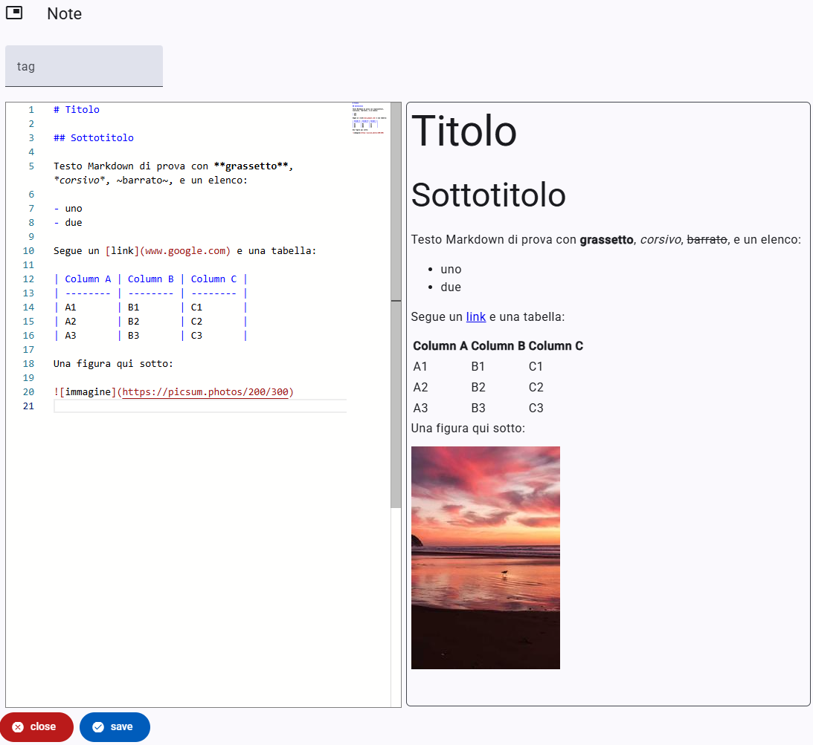

# Note Part

- 🔑 `it.vedph.note`
- ⚙️ [modello](https://github.com/vedph/cadmus-core/blob/master/docs/models/general/note.md)
- 🎯 Nota testuale libera in formato [Markdown](https://www.markdownguide.org/).

Nell'**area di testo** sinistra (o superiore, quando lo spazio orizzontale è ridotto) è possibile digitare un qualsiasi testo in formato Markdown. Il pannello di destra (o inferiore) mostra un'anteprima HTML del testo digitato.

Nella **casella di testo "tag"** si può digitare una etichetta convenzionale da usarsi per categorizzare o raggruppare variamente la nota. Se viene specificato 📚 `note-tags`, la casella diventa una casella a selezione chiusa.
